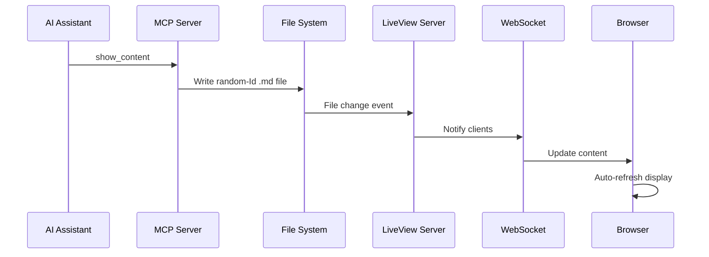

# MCP Integration Guide

This guide explains how to integrate AI assistants with the Markdown LiveView server via the Model Context Protocol (MCP).

## 1. Configure Your Assistant

Use the provided `mcp_config.json` to register the `markdown-liveview` server. The configuration launches `python mcp_server.py` and exposes a conversational set of tools for the assistant.

## 2. Initialize the MCP Server

Once connected, call `tools/list` to discover the available actions and `initialize` the session as usual for MCP clients.

## 3. Start Creating Markdown Files

Your AI assistant can now use these MCP tools:

## Available MCP Tools

### `show_content`
Creates new markdown content and automatically assigns a random File Id (e.g., `a1b2c3d4.md`).

**Parameters:**
- `content` (required): Markdown text to write.
- `title` (optional): A human-friendly label echoed in responses.

**Returns:** A message that includes the generated File Id you must reuse for future operations.

**Example:**
```json
{
  "name": "show_content",
  "arguments": {
    "title": "Sprint Plan",
    "content": "# Sprint Plan\n\n- Item 1\n- Item 2"
  }
}
```

### `list_content`
Lists every markdown entry in the managed directory together with size and timestamp metadata.

**Parameters:** None

### `view_content`
Reads the markdown associated with a previously returned File Id.

**Parameters:**
- `fileId` (required): The exact File Id string returned by `show_content`.

**Example:**
```json
{
  "name": "view_content",
  "arguments": {
    "fileId": "a1b2c3d4.md"
  }
}
```

### `update_content`
Appends to or replaces an existing markdown entry.

**Parameters:**
- `fileId` (required): Target File Id.
- `content` (required): Markdown to append or replace.
- `mode` (optional): `"append"` (default) or `"replace"`.

**Example:**
```json
{
  "name": "update_content",
  "arguments": {
    "fileId": "a1b2c3d4.md",
    "content": "## Decisions\n\n- Added more detail",
    "mode": "append"
  }
}
```

### `remove_content`
Deletes the markdown entry identified by its File Id.

**Parameters:**
- `fileId` (required): Identifier returned from `show_content`.

## Integration Flow



## Benefits

### For AI Assistants
- ✅ **Natural phrasing**: Tools match prompts like “show a plan” or “update this diagram”.
- ✅ **Automatic File Ids**: No need to guess filenames—reuse the returned identifier for future calls.
- ✅ **Complete lifecycle**: Create, read, list, update, and remove content from one protocol surface.
- ✅ **Live feedback**: Every change is reflected instantly in the LiveView UI.

### For Users
- ✅ **Real-time visibility** of the assistant’s work-in-progress.
- ✅ **Consistent organization** thanks to randomly generated, unique File Ids.
- ✅ **Simple cleanup** via the `remove_content` tool when drafts are no longer needed.
