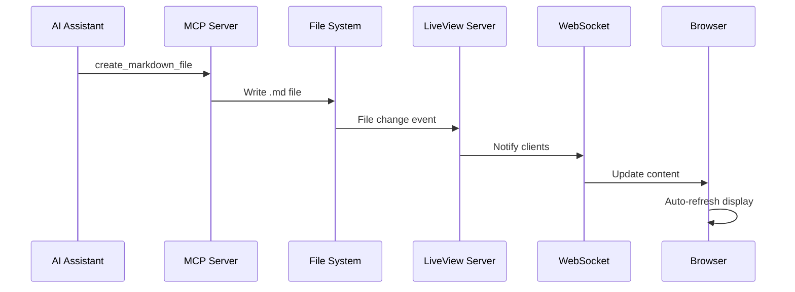

# MCP Server Integration for AI-Generated Markdown

This document explains how to use the Model Context Protocol (MCP) server to allow AI assistants to directly create and manage markdown files in the LiveView system.

## What is MCP?

Model Context Protocol (MCP) is a standard created by Anthropic that allows AI assistants to interact with external tools and services in a standardized way. This implementation provides an MCP server that AI assistants can use to create, read, update, and delete markdown files.

## Quick Start

### 1. Start the System

```bash
# Start both LiveView and MCP server capabilities
./run_with_mcp.sh
```

This will:
- ✅ Install all dependencies (including MCP)
- ✅ Test MCP server functionality  
- ✅ Start the LiveView server at http://localhost:8080
- ✅ Make MCP server available for AI assistants

### 2. Configure Your AI Assistant

Use the provided `mcp_config.json` configuration file to connect your AI assistant to the MCP server:

```json
{
  "mcpServers": {
    "markdown-liveview": {
      "command": "python",
      "args": ["mcp_server.py"],
      "cwd": ".",
      "description": "MCP server for managing markdown files in the live view system"
    }
  }
}
```

### 3. Start Creating Markdown Files

Your AI assistant can now use these MCP tools:

## Available MCP Tools

### `create_markdown_file`
Creates a new markdown file with automatic numbering.

**Parameters:**
- `filename` (required): Name of the file (without .md extension)
- `content` (required): Markdown content to write
- `prefix` (optional): Custom prefix (e.g., "01-"). Auto-generated if not provided.

**Example:**
```json
{
  "name": "create_markdown_file",
  "arguments": {
    "filename": "my-new-post",
    "content": "# My New Post\n\nThis was created by AI!"
  }
}
```

### `list_markdown_files`  
Lists all markdown files in the directory with metadata.

**Parameters:** None

**Returns:** List of files with names, sizes, and timestamps.

### `read_markdown_file`
Reads the content of a specific markdown file.

**Parameters:**
- `filename` (required): Name of file to read (with or without .md extension)

**Example:**
```json
{
  "name": "read_markdown_file", 
  "arguments": {
    "filename": "my-new-post"
  }
}
```

### `update_markdown_file`
Updates an existing markdown file by appending or replacing content.

**Parameters:**
- `filename` (required): Name of file to update
- `content` (required): Content to add or replace with
- `mode` (optional): "append" (default) or "replace"

**Example:**
```json
{
  "name": "update_markdown_file",
  "arguments": {
    "filename": "my-new-post",
    "content": "\n\n## Update\n\nThis content was appended!",
    "mode": "append"
  }
}
```

### `delete_markdown_file`
Deletes a markdown file.

**Parameters:**
- `filename` (required): Name of file to delete

## Integration Flow



## Benefits

### For AI Assistants
- ✅ **Direct file creation**: No need for intermediary steps
- ✅ **Automatic numbering**: Files are properly ordered
- ✅ **Error handling**: Robust error messages and validation
- ✅ **File management**: Full CRUD operations on markdown files

### For Users  
- ✅ **Real-time updates**: See AI-created content instantly
- ✅ **Live collaboration**: AI and humans can work together
- ✅ **Rich formatting**: Full markdown and Mermaid diagram support
- ✅ **Seamless integration**: AI-created files appear alongside manual ones

## Testing

Test the MCP server functionality:

```bash
# Run automated tests
python test_mcp.py

# Start MCP server standalone
python mcp_server.py --dir markdown

# Test with AI assistant tools
# (Use your AI assistant's MCP client to connect and test)
```

## Example AI Workflow

1. **AI receives user request**: "Create a project status report"
2. **AI calls `create_markdown_file`**:
   ```json
   {
     "filename": "project-status-report",
     "content": "# Project Status Report\n\n## Overview\nProject is on track...\n\n## Next Steps\n- Complete feature X\n- Test integration Y"
   }
   ```
3. **File appears instantly** in LiveView at http://localhost:8080
4. **User sees real-time update** in their browser
5. **AI can update the file** with new information using `update_markdown_file`

## Troubleshooting

### MCP Server Won't Start
- Ensure `mcp` package is installed: `pip install mcp`
- Check that Python path is correct in configuration
- Verify markdown directory exists and is writable

### Files Don't Appear in LiveView
- Ensure LiveView server is running on correct port
- Check file permissions in markdown directory
- Verify file watcher is functioning (check server logs)

### AI Assistant Can't Connect
- Verify MCP configuration file path
- Check that MCP server process can start
- Ensure AI assistant supports MCP protocol

## Advanced Usage

### Custom Directory
```bash
python mcp_server.py --dir /path/to/custom/directory
```

### Integration with Existing Workflows
The MCP server works alongside existing file creation methods. Files created manually, via scripts, or through other tools will all appear in the unified LiveView.

### Performance
- File operations are asynchronous and non-blocking
- WebSocket updates are near-instant (< 100ms)
- Supports concurrent AI assistant connections
- Automatic file numbering prevents conflicts

## Security Considerations

- MCP server only operates within specified directory
- No network access beyond localhost required
- File operations are validated and sanitized
- Error messages don't expose system information

---

**Result**: Seamless AI-to-markdown workflow with real-time collaboration! 🤖📝✨