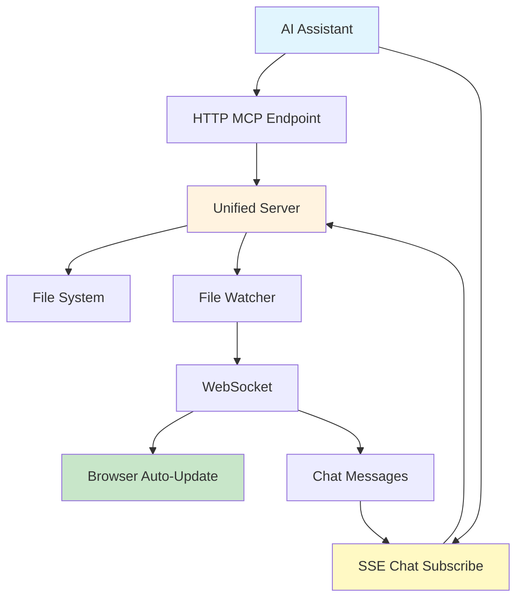

# Asynkron.LiveView -  CLI AI Companion


A live view system for markdown files that automatically detects, orders, and displays markdown content with real-time updates via WebSocket.

---

## Why This Matters

When working with CLI-based AI agents such as **Codex CLI** or **CoPilot CLI**, you often get streams of progress, design discussions, reasoning, and plans logged as markdown into a folder (for example `/logs`).  

**Asynkron.LiveView** connects to that folder and instantly visualizes the evolving state of the agent’s thoughts. This gives you a **real-time debugging and mental model helper**:  

- See the agent’s reasoning unfold as structured markdown  
- Follow design decisions as they develop  
- Inspect progress logs in chronological order  
- Visualize system diagrams and flows directly with **Mermaid.js**  
- Keep context without digging through scattered files  

Instead of reading static logs or scrolling endlessly in a terminal, you get a **clear, dynamic, and live view** of what your AI agent is doing.

## How to

- Open a browser to: `http://localhost:8080/?path={path-to-your-markdown-logs}`.
- Example: `http://localhost:8080/?path=~/git/asynkron/Asynkron.DurableFunctions/Logs`

### Inside your own project repository

Create a folder for your markdown logs, e.g. `/logs`.<br/>
You can decide if you want to keep the logs as part of your git history, a form of architectural records.<br/>
Or simply .gitignore the contents.<br/>

Update your `agents.md` (or similar file depending on agent) to something similar to this:

```
## CLI
- when working using in the CLI, I want you to place markdown files into a /logs directory. we have a special viewer that display any new content there. we can show mermaid diagrams, code diffs, code snippets, architectural plans etc.

Example log file: `log{unixtimestamp}.md` - always use the current unix timestamp to ensure unique filenames.

 Boring activities:
 ### 2025-09-27 17:20 CEST — MultiHost Soak Test Initiated
 * ✅ Goal: repeat Category=MultiHost suite for 5 consecutive passes.
 * ✅ Loop cadence: sequential runs, capturing per-iteration duration & status.
 * ✅ Environment: local Testcontainers PostgreSQL (auto-provisioned per run).
 * ⚠️ Something broke a bit.
 * ❌ Something terrible happened
 
 Infographics / Examples
 // Mermaid diagrams - use often, class, sequence and flow charts. make sure to escpae { ( node and other reserved chars in mermaid syntax
 // Relevant Code blocks
 // Test result table + summary
 // Log snippets.
 
 Success stories, we completed some larger work
 ### 2025-09-27 17:20 CEST — VICTORY!
 * ⭐️ We did it! All tests passed!
 * ⭐️ Everything is awesome!
 * 🎉 5/5 passes of Category=MultiHost suite.

---

### Always add log files when:

1. building the project
- report build success or failure
- include any relevant build errors
2. running tests
   - report test success or failure
   - include test summary and any relevant test failures 
3. making any code changes
   - include code diffs or snippets of the changes made, whichever makes most sense
4. completing any significant task
   - include a summary of what was accomplished
   - highlight any important details or next steps 
5. every 15 minutes if nothing else has happened
   - provide a brief status update
   - mention any ongoing tasks or upcoming milestones
6. whenever you make a plan or change a plan
   - outline the new plan or changes made
   - explain the reasoning behind the changes
   - confirm with user that the plan aligns with their goals
7. whenever you think the user would benefit from an update
   - use your judgment to determine when an update is warranted
- consider the user's perspective and what information would be most helpful
```

---

## Features

- 📄 **Unified Markdown View**: Reads `.md` files from a folder and displays them as a single, unified document  
- ⏰ **Chronological Ordering**: Files are automatically ordered by creation timestamp  
- 🔄 **Live Updates**: Real-time detection of new markdown files with WebSocket streaming  
- 🎨 **Rich Rendering**: Full support for markdown syntax and Mermaid diagrams  
- 🌐 **Web Interface**: Clean, responsive HTML interface with marked.js and mermaid.js  

---

## Installation & Quick Start

### ⚡ One-Command Setup (Recommended)

```bash
./run.sh
```

That's it! The script will automatically:
- ✅ Detect your Python installation
- ✅ Set up a virtual environment 
- ✅ Install all dependencies
- ✅ Create the markdown directory
- ✅ Start the server at `http://localhost:8080`

### 🔧 **Manual Setup**

If you prefer manual setup:

1. **Install Dependencies**:
   ```bash
   pip install -r requirements.txt
   ```

2. **Run the Server**:
   ```bash
   python start.py
   ```
   
   Or directly:
   ```bash
   python server.py
   ```

3. **Open Your Browser**:
   Navigate to `http://localhost:8080`

4. **Add Markdown Files**:
   Drop `.md` files into the `markdown/` directory and watch them appear automatically!

### 🛠️ **Script Options**

The `run.sh` script supports several options for different environments:

```bash
# Full automated setup (creates virtual environment)
./run.sh

# Skip virtual environment, use system Python
./run.sh --system

# Skip virtual environment setup entirely  
./run.sh --no-venv

# Use custom port
PORT=3000 ./run.sh

# Watch different directory
MARKDOWN_DIR=docs ./run.sh

# Show help
./run.sh --help
```

The script automatically handles:
- 🐍 **Python Detection**: Finds Python 3.7+ automatically
- 📦 **Dependency Management**: Tries multiple installation strategies
- 🏠 **Environment Setup**: Creates isolated virtual environment
- 🔧 **Error Recovery**: Graceful fallbacks for different system configurations
- 🍎 **Cross-Platform**: Works on Linux, macOS, and WSL

## Usage

### Unified Server (Recommended)

The new unified server combines both LiveView and MCP functionality in a single process:

```bash
# Quick start with unified server
./run_unified.sh

# Or run directly
python unified_server.py --help
```

**Unified Server Options:**
- `--dir DIRECTORY`: Specify the directory to watch for markdown files (default: `markdown`)
- `--port PORT`: Set the server port (default: `8080`)
- `--disable-mcp`: Disable MCP functionality (LiveView only)
- `--mcp-stdio`: Enable MCP stdio server alongside HTTP server

### Legacy Command Line Options

```bash
python server.py --help
```

- `--dir DIRECTORY`: Specify the directory to watch for markdown files (default: `markdown`)
- `--port PORT`: Set the server port (default: `8080`)

### Dynamic Path Support

The server now supports pointing to different directories in multiple ways:

#### 1. Query Parameter (Highest Priority)

Navigate to any directory using the `path` query parameter:

```bash
# Point to a specific directory
http://localhost:8080/?path=/path/to/your/markdown/files

# Use tilde expansion for home directory  
http://localhost:8080/?path=~/Documents/notes

# Example from the original request
http://localhost:8080/?path=~/git/asynkron/Asynkron.DurableFunctions/Logs
```

#### 2. Environment Variable (Fallback)

Set the `LIVEVIEW_PATH` environment variable:

```bash
# Using the script
LIVEVIEW_PATH=~/git/project/docs ./run.sh

# Using the server directly
LIVEVIEW_PATH=/path/to/markdown python server.py
```

#### 3. Command Line Argument (Default)

Use the traditional `--dir` argument:

```bash
python server.py --dir /path/to/markdown --port 3000
```

### Priority Order

1. Query parameter (`?path=...`)
2. Environment variable (`LIVEVIEW_PATH`)  
3. Command line argument (`--dir`)
4. Default (`markdown/`)

### Fallback Behavior

When the specified directory is missing or empty, the server displays helpful markdown content explaining:
- What went wrong
- How to fix the issue
- Usage examples
- Alternative methods to specify paths

### Example

```bash
python server.py --dir /path/to/my/docs --port 3000
```

## How It Works

1. **File Monitoring**: Uses `watchdog` to monitor the markdown directory for new `.md` files
2. **Content Merging**: Reads all markdown files and orders them by creation timestamp
3. **WebSocket Updates**: Pushes real-time updates to all connected browser clients
4. **Client Rendering**: Browser renders unified content using marked.js for markdown and mermaid.js for diagrams

## API Endpoints

- `GET /`: Main web interface
  - Query parameter: `?path=/path/to/directory` - Specify custom directory
- `GET /ws`: WebSocket endpoint for live updates
  - Query parameter: `?path=/path/to/directory` - Specify custom directory for WebSocket connection  
- `GET /api/content`: JSON API returning unified markdown content
  - Query parameter: `?path=/path/to/directory` - Specify custom directory
  - Returns: `{content, files, timestamp, directory}`

### MCP Endpoints

- `POST /mcp`: JSON-RPC endpoint for MCP protocol
  - Supports MCP tools: `show_content`, `list_content`, `view_content`, `update_content`, `remove_content`, `subscribe_chat`, `get_chat_messages`
- `GET /mcp/chat/subscribe`: **SSE (Server-Sent Events)** endpoint for real-time chat messages
  - Returns `text/event-stream` for push-based chat notifications
  - Alternative to polling with `get_chat_messages`
  - Example:
    ```bash
    curl -N http://localhost:8080/mcp/chat/subscribe
    # Output: Server-Sent Events stream with chat messages
    ```

## MCP Server Integration 🤖

**UPDATED**: The system now features a unified server that combines both LiveView and MCP functionality in a single process!

### Unified Server Architecture

The new unified server provides:
- **Single Process**: No need to manage separate servers
- **HTTP MCP Endpoint**: AI assistants can use `POST /mcp` for JSON-RPC communication
- **Shared Resources**: Common file watching and directory management  
- **Real-time Integration**: MCP-created files immediately appear in LiveView
- **Simplified Deployment**: One server to start and stop

### Quick Start with Unified Server

```bash
# Start the unified server (recommended)
./run_unified.sh
```

### MCP Integration Flow



**Chat Integration**: When users send chat messages from the browser, they are:
1. Sent via WebSocket to the server
2. Pushed to AI assistants via SSE (`/mcp/chat/subscribe`)
3. Also available via polling (`get_chat_messages` tool)

### Legacy MCP Setup (Still Supported)

For backwards compatibility, the original separate MCP server is still available:

```bash
# Start both LiveView and make MCP server available
./run_with_mcp.sh
```

### MCP Server Tools

The MCP server provides conversationally named tools for AI assistants:

- **`show_content`**: Generate new markdown content. The server picks a random File Id ending in `.md`, stores the content, and returns the identifier so the assistant can reference it later.
- **`list_content`**: List every markdown entry currently available along with helpful metadata.
- **`view_content`**: Retrieve the content for a specific File Id that was previously returned by `show_content`.
- **`update_content`**: Append to or completely replace an existing entry by supplying its File Id.
- **`remove_content`**: Delete an entry using its File Id when it is no longer needed.

#### Chat Integration Tools

- **`subscribe_chat`**: Subscribe to receive chat messages from the UI. Returns confirmation message.
- **`get_chat_messages`**: Poll for chat messages since a given timestamp (legacy/fallback method).
- **SSE Chat Stream** (Recommended): Connect to `GET /mcp/chat/subscribe` for push-based chat notifications.

**Example: Subscribing to Chat via SSE**

```bash
# Connect to SSE endpoint for real-time chat messages
curl -N http://localhost:8080/mcp/chat/subscribe

# Output (Server-Sent Events):
# data: {"type":"connected","message":"Successfully subscribed to chat messages"}
# 
# : heartbeat
# 
# data: {"type": "chat", "message": "Hello from user!", "timestamp": 1234567890.123}
```

**Example: Using Python to receive chat messages**

```python
import aiohttp
import asyncio

async def listen_to_chat():
    async with aiohttp.ClientSession() as session:
        async with session.get('http://localhost:8080/mcp/chat/subscribe') as resp:
            async for line in resp.content:
                if line.startswith(b'data: '):
                    data = json.loads(line[6:])
                    if data['type'] == 'chat':
                        print(f"Received: {data['message']}")

asyncio.run(listen_to_chat())
```

### AI Assistant Setup

#### Using Unified Server (Recommended)

1. **Start the unified server**: `./run_unified.sh`
2. **Configure your AI assistant** to use HTTP MCP endpoint
3. **Point to the MCP endpoint**: `POST http://localhost:8080/mcp`
4. **Use JSON-RPC 2.0 protocol** for communication
5. **Start creating markdown files** using the MCP tools
6. **View results instantly** in the LiveView at `http://localhost:8080`

#### Using Legacy MCP Server

1. **Configure MCP in your AI assistant** using the provided `mcp_config.json`
2. **Point to the MCP server**: `python mcp_server.py` 
3. **Start creating markdown files** using the MCP tools
4. **View results instantly** in the LiveView at `http://localhost:8080`

### MCP Integration Flow


Files created by AI assistants via MCP automatically appear in the live view with real-time updates!

### Benefits of Unified Architecture

- **Simplified Deployment**: Single process instead of managing two separate servers
- **Better Resource Management**: Shared file watching and directory management
- **Improved Performance**: Direct communication between LiveView and MCP components
- **Easier Configuration**: One port, one process, one configuration
- **Real-time Integration**: MCP file operations immediately trigger LiveView updates
- **Reduced Complexity**: Fewer moving parts to manage and debug

### Testing

```bash
# Test unified server functionality
python test_unified.py

# Test legacy MCP server
python test_mcp.py
```

### Usage Examples

```bash
# Start unified server (recommended)
./run_unified.sh

# Start unified server with custom settings
PORT=3000 MARKDOWN_DIR=docs ./run_unified.sh

# Start server with default directory
./run.sh

# Start server with MCP integration (legacy)
./run_with_mcp.sh

# Start server with environment variable
LIVEVIEW_PATH=~/Documents/notes ./run.sh

# Start server on custom port with custom directory
LIVEVIEW_PATH=/var/log/markdown PORT=3000 ./run.sh

# Access different directories via URL
curl "http://localhost:8080/api/content?path=~/git/project/docs"

# Test unified server functionality
python test_unified.py

# Test MCP server functionality (legacy)
python test_mcp.py

# Run MCP server standalone for AI assistants (legacy)
python mcp_server.py --dir markdown

# Run unified server with MCP HTTP endpoint
python unified_server.py --port 8080 --dir markdown
```

## File Structure

```
Asynkron.LiveView/
├── server.py              # Main LiveView server implementation
├── mcp_server.py           # MCP server for AI integration (NEW)
├── start.py               # Simple startup script
├── run.sh                 # Automated setup script
├── run_with_mcp.sh        # Setup script with MCP integration (NEW)
├── test_mcp.py            # MCP server test script (NEW)
├── mcp_config.json        # MCP server configuration (NEW)
├── requirements.txt       # Python dependencies (includes MCP)
├── markdown/              # Directory for markdown files
│   ├── 01-intro.md       # Sample files (ordered by timestamp)
│   └── 02-diagram.md
└── README.md
```

## Dependencies

- `aiohttp`: Async HTTP server and WebSocket support
- `websockets`: WebSocket protocol implementation  
- `watchdog`: File system monitoring
- `mcp`: Model Context Protocol for AI integration (**NEW**)

All dependencies are automatically installed by the setup scripts.

## Installation Troubleshooting

**🚀 The easiest way to avoid all setup issues is to use the automated script:**
```bash
./run.sh
```

If you encounter dependency installation issues with manual setup:

### Externally-Managed Environment (e.g., Homebrew Python)
```bash
# Use virtual environment (recommended)
python3 -m venv venv
source venv/bin/activate
pip install -r requirements.txt

# Or install to user directory
pip install --user -r requirements.txt
```

### System Installation Issues
```bash
# For systems that require explicit permission
pip install --break-system-packages -r requirements.txt

# Or use system package manager (Ubuntu/Debian)
sudo apt install python3-aiohttp python3-watchdog
```

The `start.py` script and `run.sh` script both automatically handle most installation scenarios and provide helpful guidance.

## Browser Support

The web interface uses modern JavaScript and should work in all current browsers. The system loads:

- **marked.js**: For markdown parsing and rendering
- **mermaid.js**: For diagram rendering
- **WebSocket API**: For real-time updates

## Contributing

Feel free to submit issues and pull requests to improve the system!
