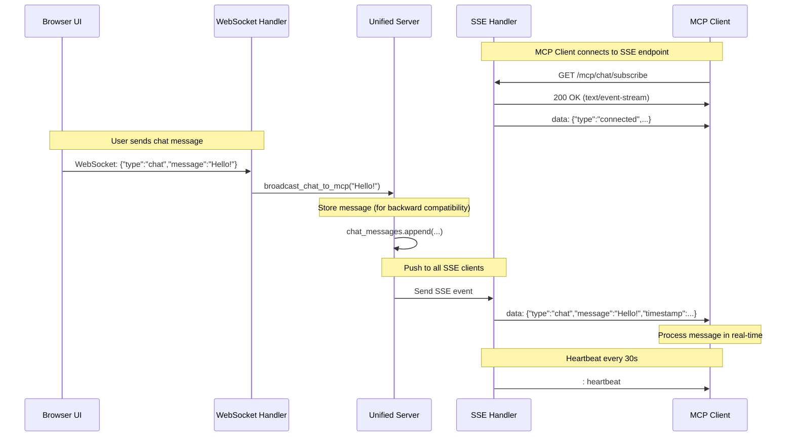

# SSE Chat Architecture

This document describes the Server-Sent Events (SSE) implementation for real-time chat message delivery.

## Overview

The SSE chat feature enables MCP clients to receive chat messages from the LiveView UI in real-time, without polling. This provides a push-based event stream that's more efficient and responsive than traditional polling.

## Architecture Diagram



## Components

### 1. SSE Endpoint (`/mcp/chat/subscribe`)

**Location:** `unified_server.py::handle_chat_sse()`

**Features:**
- Content-Type: `text/event-stream`
- Keep-alive with heartbeat comments every 30 seconds
- Automatic client tracking and cleanup
- Initial connection confirmation message

**Event Format:**
```
data: {"type": "chat", "message": "...", "timestamp": 1234567890.123}

```

### 2. WebSocket Handler

**Location:** `unified_server.py::handle_websocket()`

Receives chat messages from the browser UI and forwards them to `broadcast_chat_to_mcp()`.

### 3. Broadcast Function

**Location:** `unified_server.py::broadcast_chat_to_mcp()`

**Responsibilities:**
1. Store message in memory (backward compatibility with polling)
2. Send message to all connected SSE clients
3. Track disconnected clients and clean up

### 4. Client Tracking

**Location:** `unified_server.py::sse_clients`

A set that tracks all active SSE connections for efficient broadcasting.

## Message Flow

### User sends message from browser:

1. **Browser** → Types message in chat input
2. **Browser** → Sends via WebSocket: `{"type":"chat","message":"..."}`
3. **Server** → Receives message in WebSocket handler
4. **Server** → Calls `broadcast_chat_to_mcp()`
5. **Server** → Stores message in `chat_messages` list
6. **Server** → Iterates through `sse_clients` set
7. **Server** → Sends SSE event to each connected client
8. **MCP Client** → Receives message in real-time

### MCP Client subscribes:

1. **MCP Client** → Connects to `GET /mcp/chat/subscribe`
2. **Server** → Adds client to `sse_clients` set
3. **Server** → Sends connection confirmation
4. **Server** → Keeps connection alive with heartbeats
5. **Server** → Pushes chat messages as they arrive
6. **MCP Client** → Parses SSE events and processes messages

## Backward Compatibility

The polling-based approach is still supported:

1. **MCP Client** → Calls `subscribe_chat` tool
2. **MCP Client** → Periodically calls `get_chat_messages` with timestamp
3. **Server** → Returns new messages since timestamp

This allows older clients to continue working while new clients benefit from real-time SSE.

## Implementation Details

### SSE Event Format

SSE uses a simple text-based protocol:

```
data: <JSON payload>

```

Multiple `data:` lines can be used for a single event. Events are separated by blank lines.

### Heartbeat Messages

To keep the connection alive and detect disconnections:

```
: heartbeat

```

Lines starting with `:` are comment lines (ignored by clients but keep the connection open).

### Error Handling

- **Connection Errors:** Automatically remove client from `sse_clients`
- **Disconnected Clients:** Detected during broadcast, removed from set
- **Timeout:** Clients should reconnect if no data received for extended period

## Testing

### Manual Testing

1. Start server: `python unified_server.py`
2. Run example client: `python examples/sse_chat_client.py`
3. Open browser to `http://localhost:8080`
4. Type message in chat input
5. See message appear in real-time in example client

### Automated Testing

```bash
pytest tests/test_unified_server.py::test_sse_chat_subscription -v
```

### Using curl

```bash
curl -N http://localhost:8080/mcp/chat/subscribe
```

## Performance Considerations

- **Memory:** Chat messages limited to last 100 entries
- **Connections:** SSE uses one HTTP connection per client (lightweight)
- **Bandwidth:** Messages only sent when chat activity occurs
- **Heartbeat:** 30-second interval balances responsiveness vs overhead

## Security Considerations

- No authentication currently implemented (suitable for local development)
- Consider adding auth tokens for production use
- CORS may need configuration for cross-origin access

## Future Enhancements

- [ ] Add authentication/authorization
- [ ] Support filtering by message type
- [ ] Add message history on subscription
- [ ] Implement reconnection with last event ID
- [ ] Add rate limiting for message broadcasts
