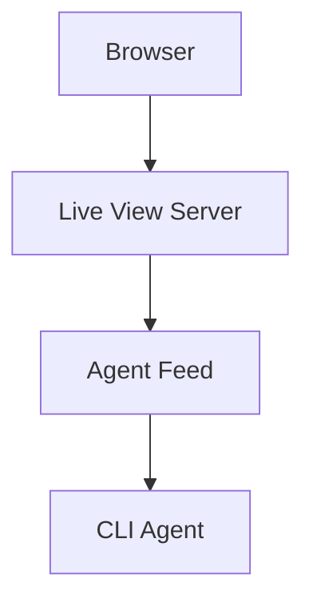

# Test Markdown File

This placeholder content used to be generated by the MCP demo. The Live View
stack now relies on the WebSocket agent feed instead.

## Features
- ✅ Appears in live view
- ✅ Updates when edited on disk
- ✅ Works with the new agent feed

## Sample Code

```python
def hello_agent_feed():
    print("Hello from the new chat bridge!")
    return "success"
```

## Sample Mermaid Diagram



This file demonstrates how existing markdown content continues to work while the
chat plumbing evolves.
