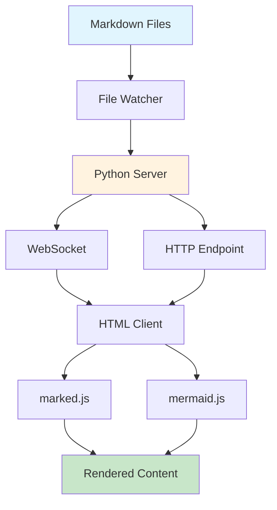

# System Architecture Diagram

Here's a Mermaid diagram showing how the live view system works:

## Flow Description

1. **File Detection**: Watchdog monitors the markdown directory
2. **Content Processing**: Server reads and orders files by creation time
3. **Live Updates**: WebSocket pushes updates to connected clients
4. **Rendering**: Client-side JavaScript renders markdown and diagrams