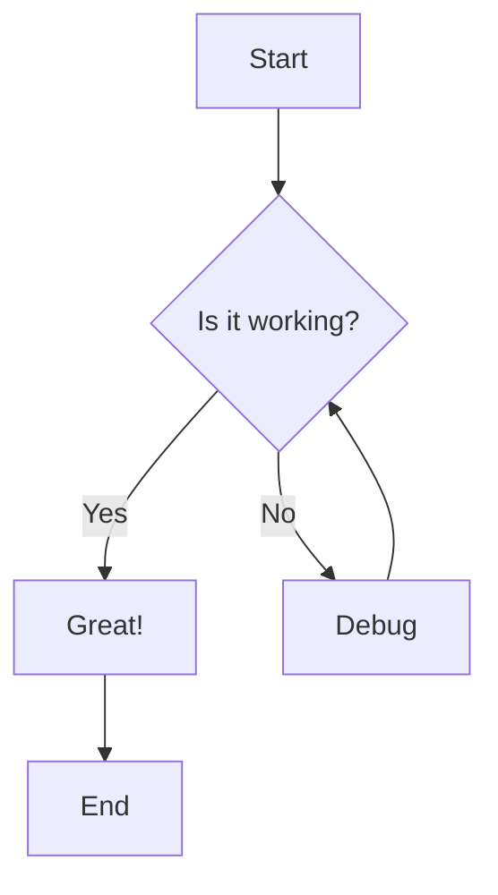

# Test Document with Mermaid

This document tests markdown and mermaid rendering for PDF export.

## Sample Flowchart



## Features Tested

- Markdown rendering
- Code blocks
- Mermaid diagrams
- Interactive delete and download buttons

## Code Example

```python
def hello_world():
    print("Hello, World!")
```

This is a test document to verify the file action buttons work correctly.
