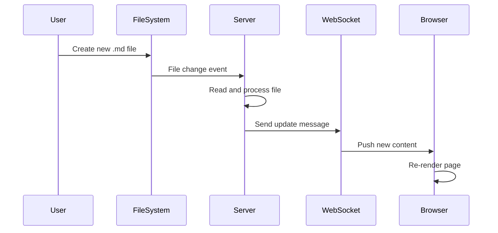

# Testing Live Updates

This file was created to test the live update functionality!

## Code Example

Here's some Python code:

```python
def hello_world():
    print("Hello from the live view system!")
    return "success"

# This should trigger a live update
hello_world()
```

## Mermaid Sequence Diagram



## Status: ✅ Live Update Test Successful!