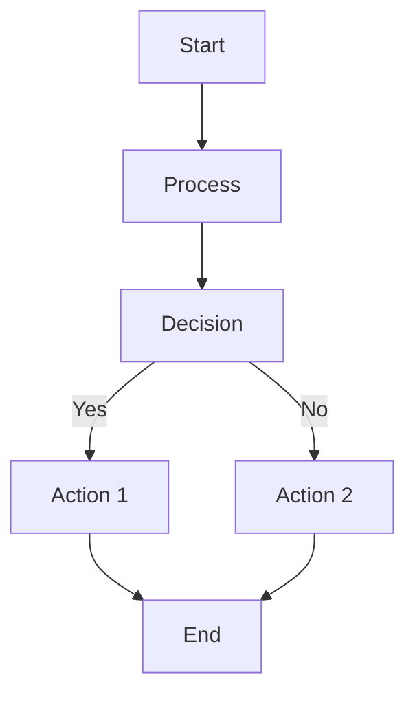
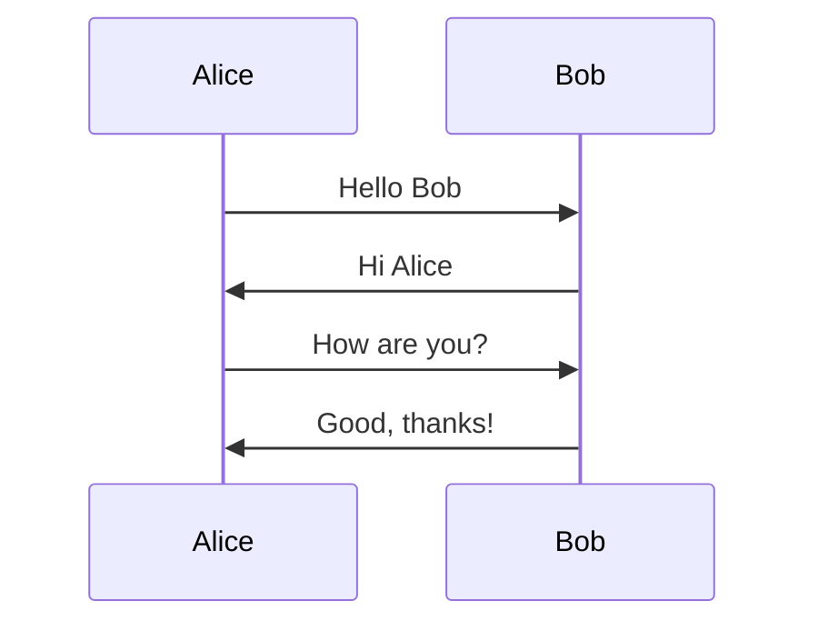
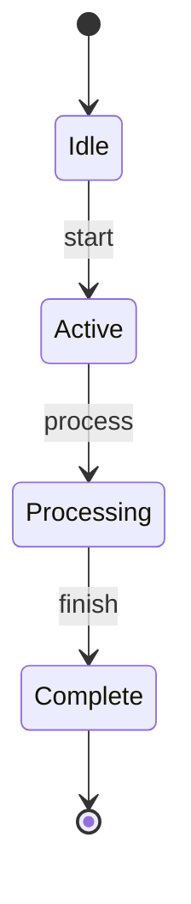
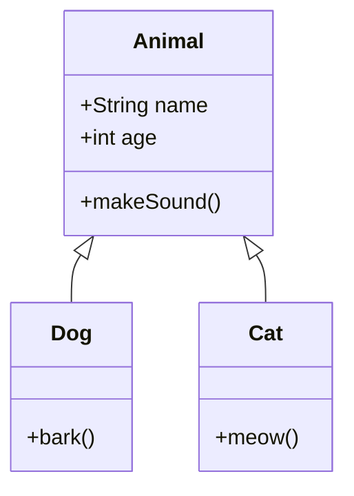
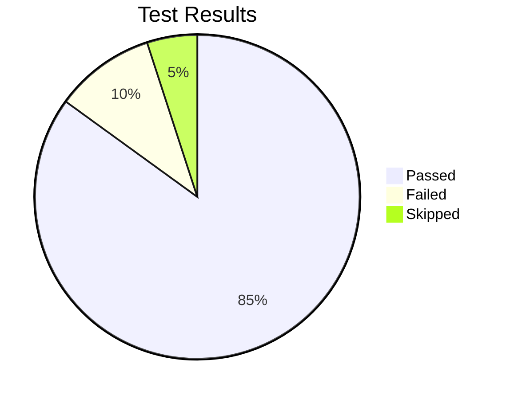

# Stress Test - Multiple Mermaid Diagrams

This file contains multiple Mermaid diagrams to test the async rendering fix.

## Diagram 1: Flow Chart

## Diagram 2: Sequence

## Diagram 3: State Diagram

## Diagram 4: Class Diagram

## Diagram 5: Pie Chart

This file tests the async rendering fix with multiple diagrams to ensure UI responsiveness.