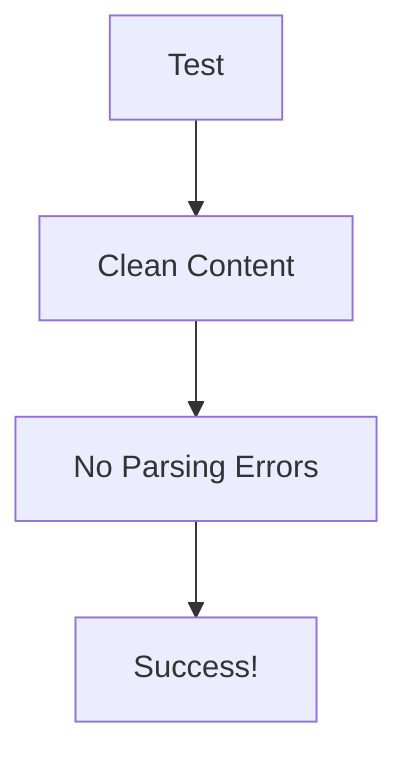

# Mermaid Fix Test

Testing the fixed Mermaid rendering with clean content storage.

```mermaid
graph TD
    A[Test] --> B[Clean Content]
    B --> C[No Parsing Errors]
    C --> D[Success!]
```

This should render properly when Mermaid loads.