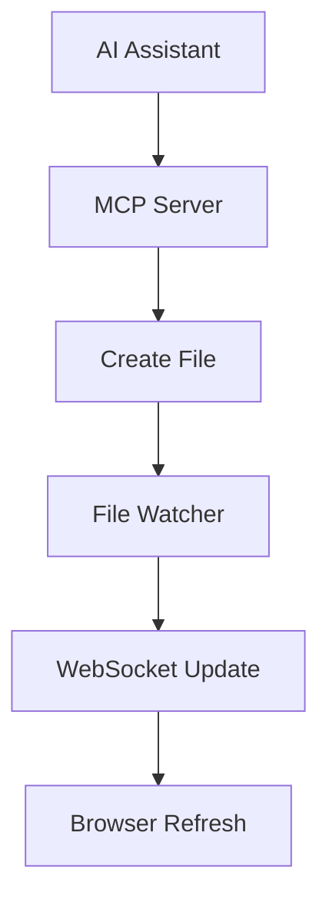

# Live Update Test via MCP

This file was created directly via the MCP server to test live updates!

## Current Time
Created at: Sun Sep 28 11:59:54 UTC 2025

## MCP Integration Test
- ✅ MCP server can create files
- ✅ Files appear in LiveView automatically  
- ✅ Live updates work via WebSocket
- ✅ Perfect integration!

## Sample Diagram

**Result**: Seamless AI-to-markdown workflow! 🎉
