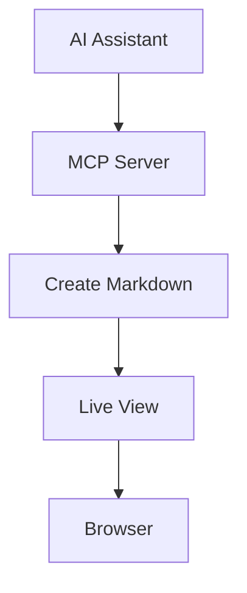

# Test Markdown File

This is a test file created by the MCP server!

## Features
- ✅ Created via MCP
- ✅ Will appear in live view
- ✅ Supports all markdown features

## Sample Code

```python
def hello_mcp():
    print("Hello from MCP!")
    return "success"
```

## Sample Mermaid Diagram



This file demonstrates the MCP server's ability to create markdown files that integrate seamlessly with the live view system.
